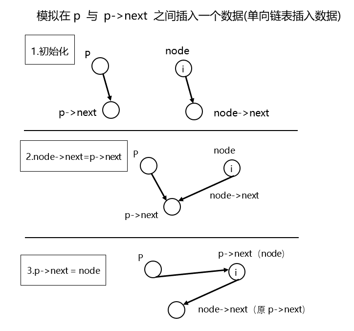
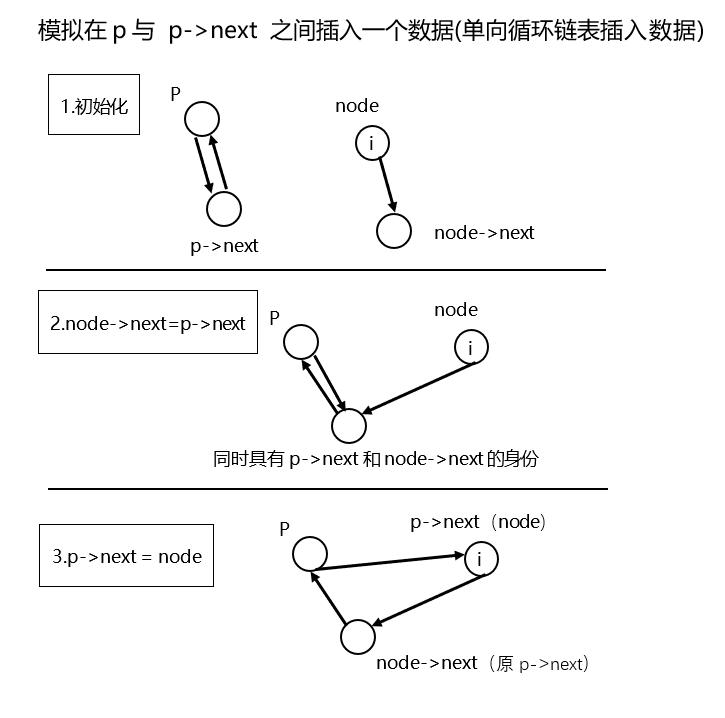
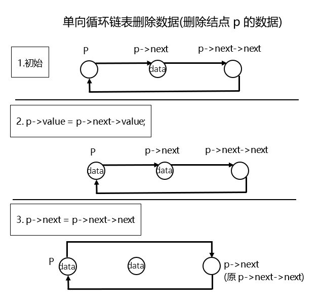

## 何为链表

链表和数组都可用于存储数据，其中链表通过指针来连接元素，而数组则是把所有元素按次序依次存储。

不同的存储结构令他们有了不同的优势：

链表可以方便地删除、插入数据，操作次数是 $O(1)$ 。但也因为这样寻找读取数据的效率不如数组高，在随机访问数据中的操作次数是 $O(n)$ 。

数组可以方便的寻找读取数据，在随机访问中操作次数是 $O(1)$ 。但删除、插入的操作次数却是却是 $O(n)$ 次。

## 构建链表

关于链表的构建使用到指针的部分比较抽象，光靠文字描述和代码可能难以理解，建议配合作图来理解。

### 单向链表

单向链表中包含数据域和指针域，其中数据域用于存放数据，指针域用来连接当前结点和下一节点。

```c++
struct Node {
  int value;
  Node *next;
};
```

### 双向链表

双向链表中同样有数据域和指针域，不同之处在于指针域有左右（或上一个、下一个）之分，用来连接上一个节点、当前结点、下一个结点。

```c++
struct Node {
  int value;
  Node *left;
  Node *right;
};
```

## 向链表中插入（写入）数据

### 单向链表

```c++
void insertNode(int i, Node *p) {
  Node *node = new Node;
  node->value = i;
  node->next = p->next;
  p->next = node;
}
```

具体过程可参考下面这张图。



### 单向循环链表

上面介绍了简单的单向链表的插入数据，有时我们会将链表的头尾连接起来将链表变为循环链表

```c++
void insertNode(int i, Node *p) {
  Node *node = new Node;
  node->value = i;
  node->next = NULL;
  if (p == NULL) {
    p = node;
    node->next = node;
  } else {
    node->next = p->next;
    p->next = node;
  }
}
```

由于是循环的链表，我们在插入数据时需要判断原链表是否为空，为空则自身循环，不为空则正常插入数据循环。具体过程可参考下面这张图。



### 双向循环链表

```c++
void insertNode(int i, Node *p) {
  Node *node = new Node;
  node->value = i;
  if (p == NULL) {
    p = node;
    node->left = node;
    node->right = node;
  } else {
    node->left = p;
    node->right = p->right;
    p->right->left = node;
    p->right = node;
  }
}
```

## 从链表中删除数据

### 单向（循环）链表

```c++
void deleteNode(Node *p) {
  p->value = p->next->value;
  p->next = p->next->next;
}
```

从链表中删除某个结点时，将 p 的下一个结点 (p->next) 的值覆盖给 p 即可，与此同时更新 p 的下下个结点。具体过程可参考下面这张图。



### 双向循环链表

```c++
void deleteNode(Node *p) {
  p->value = p->right->value;
  p->left->right = p->right;
  p->right->left = p->left;
  p = p->right;
}
```
